# CloudFaster Academy: Laboratório de resliência com EC2 + Load Balance + Auto Scaling

> **Autor:** [CloudFaster Tecnologia](https://cloudfaster.com.br), **Última revisão:** 31/10/2022

## Introdução

Neste laboratório iremos provisionar um ambiente resiliente e escalável, vamos subir uma aplicação em uma Amazon EC2, configurar um balanceador de carga e o serviço de Auto Scaling.
Para este cenário estaremos utilizando os seguintes serviços da AWS:

- Amazon EC2 (Amazon Elastic Compute Cloud):
    - Serviço de de capacidade computacional da AWS.

- ELB (Elastic Load Balancing):
    - Serviço de balanceadro de cargas da AWS.
    - Distribui o tráfego de rede para melhorar a escalabilidade da aplicação.

- AWS Auto Scaling:
    - Serviço que monitora os aplicativos e ajusta automaticamente a capacidade.
    - Serviço de escalabildiade da AWS.

## Pré-requisitos

1) Uma conta na AWS.
2) Um usuário com permissões suficientes para acessar os recursos necessários (EC2, VPC, ELB, Auto Scaling).

## Hands-on

## Passo 1: Subir uma EC2 com script de inicialização para aplicação web

Após acessar sua conta AWS, navegue até o serviço "EC2" ou acesse diretamente por esse link:
https://console.aws.amazon.com/ec2.

Clique em execultar instâncias

Agora vamos configurar os parâmetros da EC2.

- Nome: LAB_EC2

- Sistema Operacional: Vamos escolher o Amazon Linux com arquiterua 64bits

- Tipo de instância: Vamos selecionar a t2.micro a fim de utilizar o free tier da AWS

- Clicar em Criar nova chave de acesso

- Par de chaves de acesso:
    - Nome: key_lab_ec2
    - Tipo de par de chaves: Vamos deixar o padrão RSA
    - Formato:
        - .pem (recomendada para quem utiliza sistema operacional Linux ou Mac)
        - .ppk (recomendada para que utiliza sistema operacional Windows com o Putty instalado)

- Configurações de rede:
    - Criar grupo de segurança:
        - Permitir trafego SSH de:
            - Anywhere (é feita uma liberacao de acesso para qualquer destino)
            - Custom (é possível colocar um endereço de IP de onde deve ser feito o acesso)
            - MyIp (á AWS identifica seu IP de origem e faz a liberação apenas para ele)

- Configurações avançadas vamos colocar nosso script para que a EC2 execute o mesmo durante sua inicialização.
- Após essa etapa, clique em *"Execultar instância"*, para que a mesma seja provisionada e inicializada

## Passo 2: Testar o acesso web na aplicação

No painel do serviço de EC2, vamos verificar o estato da nossa instanância:

- Executando (EC2 ativa, provisionada e pronta para utilização)
- Prosionando (EC2 ainda está sendo disponiblizada pela AWS)

Vamos copiar o IP público da nossa instânia e testar em um navegado para validar a aplicação.    

> **Importante:** O IP externo utilizado no LAB é diferente do que vai aparecer na sua Console da AWS.

   
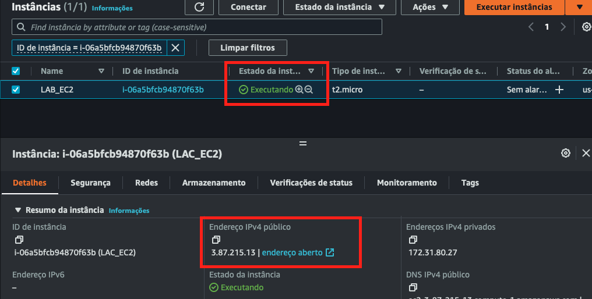

Observamos que foi retornado um erro de timeout de endereço de IP, isso ocorreu pois para validar a aplicação vamos precisar liberar a porta HTTP (TCP 80) no nosso Security Group.

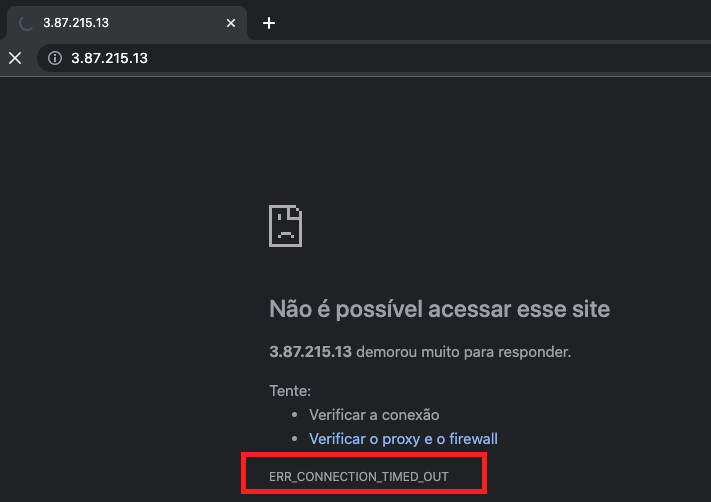

Clicando na aba *"Segurança"* vamos clicar no nosso Security Group para editar as regas de acesso.

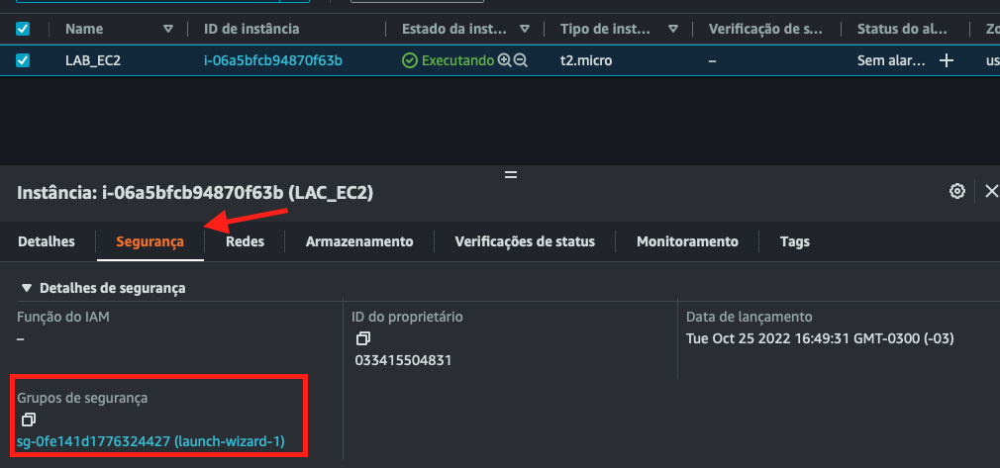

Selecionar a aba *"Regras de entrada"* e *"Editar regras de entrada"*.

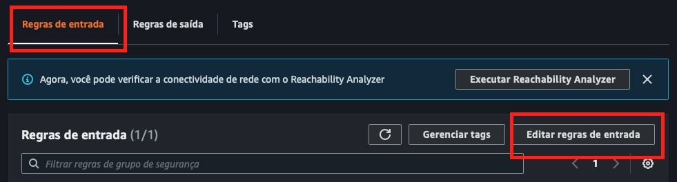

Vamos *"Adicionar regras"*, selecionar o protocolo HTTP, Colocar para *"Qualquer origem"* e vamos *"Salvar regras"*.

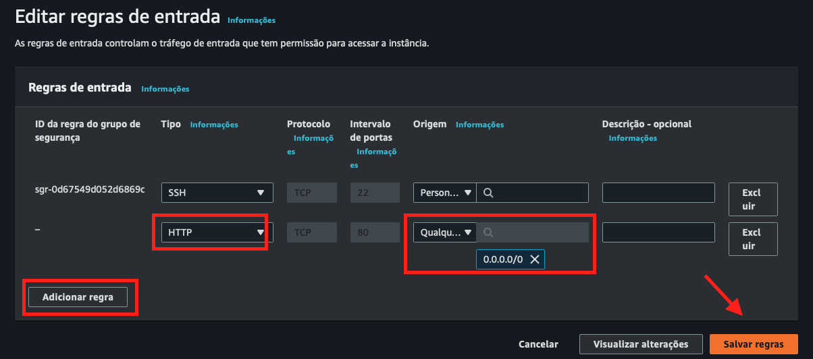

Realizando um novo teste de acesso ao IP externo, vamos ter sucesso em acessar nossa aplicação.

## Passo 3: Criar um ELB (Elastic Load Balance)

Ainda dentro do serviço de [EC2](https://console.aws.amazon.com/ec2), vamos realizar a configuração do Elastic Load Balance.

Vamos clicar em *"Balanceamento de cargas - Load Balancers*

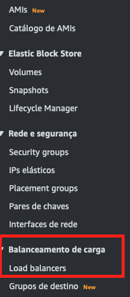

Clique em *"Criar Load Balancer"*

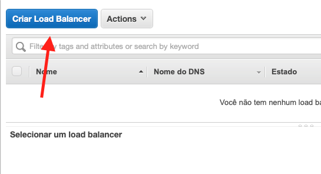

Temos três opções de Elastic Load Balancer:
- Application Load Balancer (Balanceador que atua na camada de aplicação nos protocolos HTTP e HTTPS)

- Network Load Balancer (Balanceador que atua na camada de rede fazendo chamadas nos protocolos TCP, UDP e TSL)

- Gateway Load Balancer (Distribuir tráfego entre dispositivos virtuais)

Como queremos balancer uma aplicação web, vamos utilizar o *"Applicaton Load Balance"*.

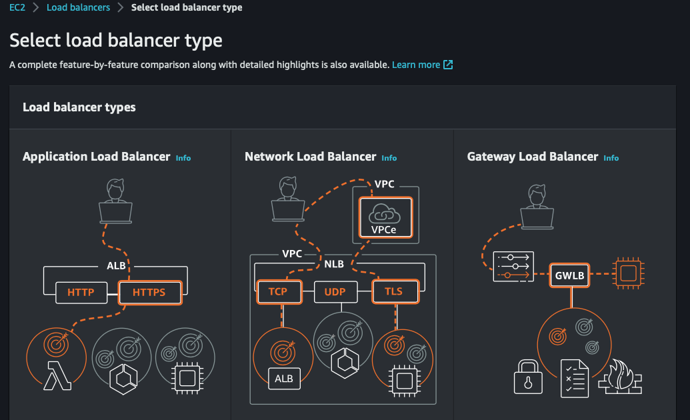

Preencher o nome (*ELB-LAB-EC2*) do nosso ELB, deixar ele com interface para internet e utilizar o padrão de IPV4.

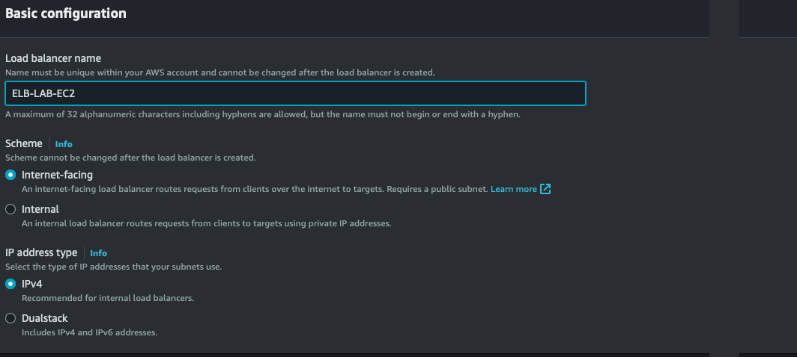

No Painel de EC2, temos a coluna onde temos a *Zona de Disponibilidade* que ela está. no nosso exemploe ela fica em *`us-east-1`*

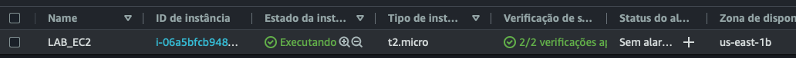

Na configuração do Load Balance, vemos que ele mostra todas as *Zonas de Disponilidade* que pertecem a VPC

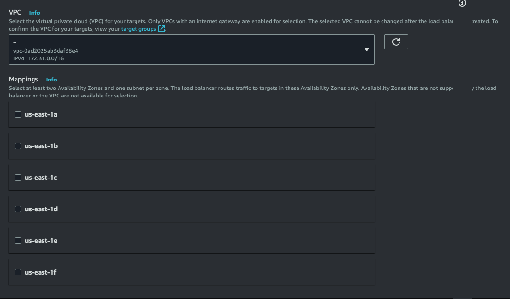

Vamos selecionar *Duas*, uma é a que a nossa EC2 está (`us-east-1`) e podemos escolher outra onde futuramente podemos configurar outra EC2.

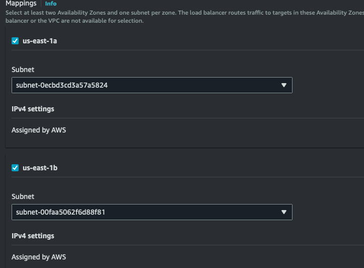

Configurar um novo *Security Group* para o nosso Load Balance

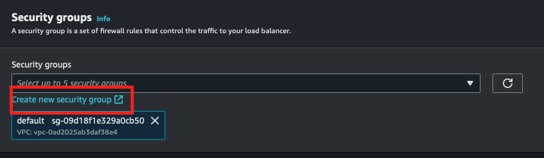

Atribuições:
- *Nome* para o *Security Group* 
- Adicionar o protocolo HTTP para ser acessado que qualquer origem

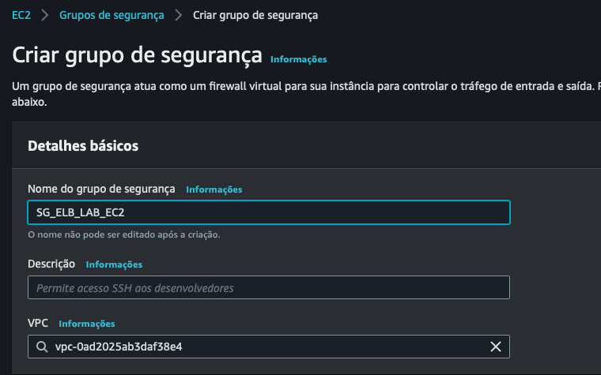

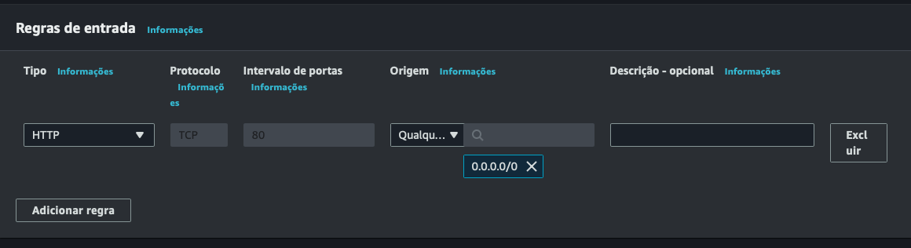

Vamos selecionar o *Security Group* criado para o nosso ELB

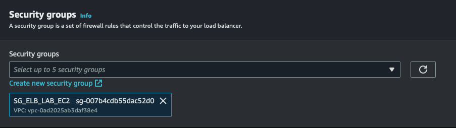

## Passo 4: Registrar a EC2 no ELB (Elistic Load Balance)

Clique em  *Create Target Group*

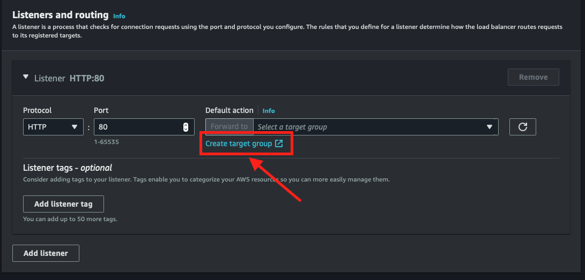

Na configuração do *Target Group*, temos alguns tipos de *Target*, pro nosso ALB vamos utilizar o Type `Instância`

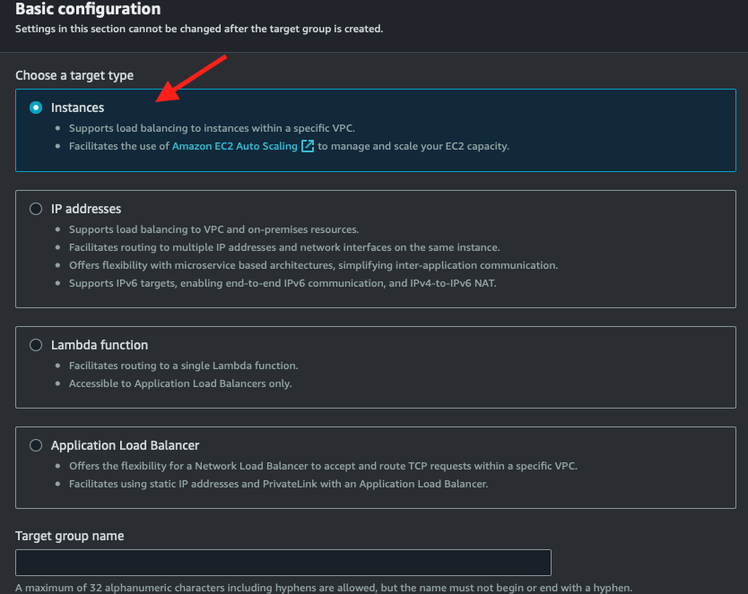

Vamos colocar um *Nome* e a porta que o nosso *Target* vai trabalhar.
- Nome: `TARGET_LAB_EC2`
- Porta 80 (protocolo HTTP)

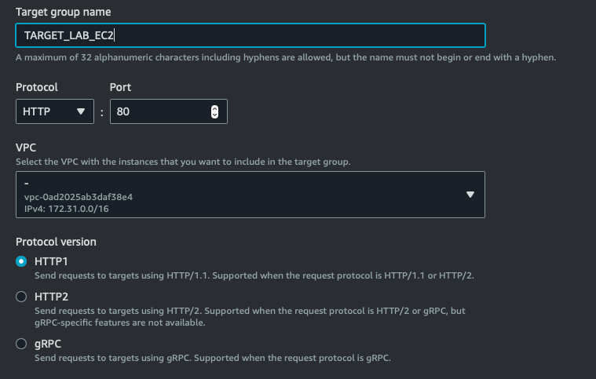

Seleciona a *Instância* que foi criada no inicio do LAB e clique em *Include as pending below*.

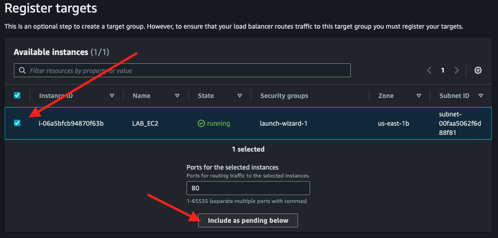

Criando nosso Listener

Vamos selecionar o *Target Group* que acabamos de criar

Clicar quem *Criar Load Balancer*

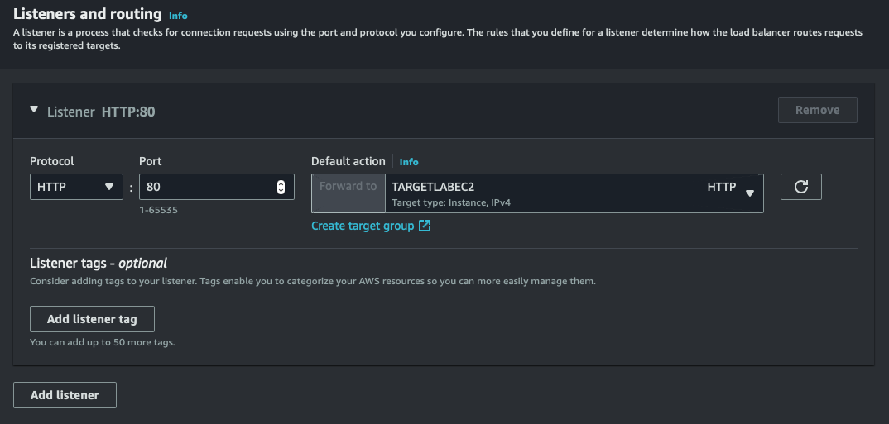

## Passo 5: Testar o acesso pelo ELB (Elastic Load Balance)

Navegando na tela da Load Balance vamos copiar o nome de DNS criado para testar o acesso em um navegado

> **Importante:** Para o ELB ficar como *Ativo* pode demorar alguns minutos.

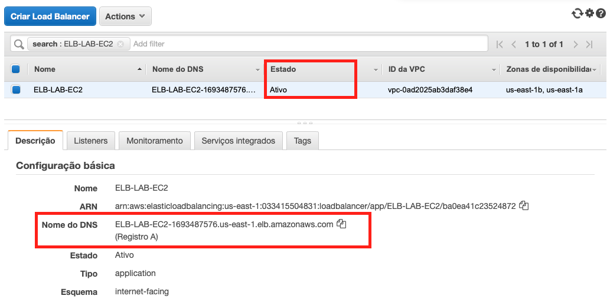

Cole o link do DNS do Load Balancer e acesse sua aplicação

## Passo 6: Criar uma AMI e guardar o ID

No serviço de EC2, vamos selecionar a *Instância* que criamos:
- Clicar em *Açoes*
    - *Imagem e modelos*
        - *Criar Imagem* 

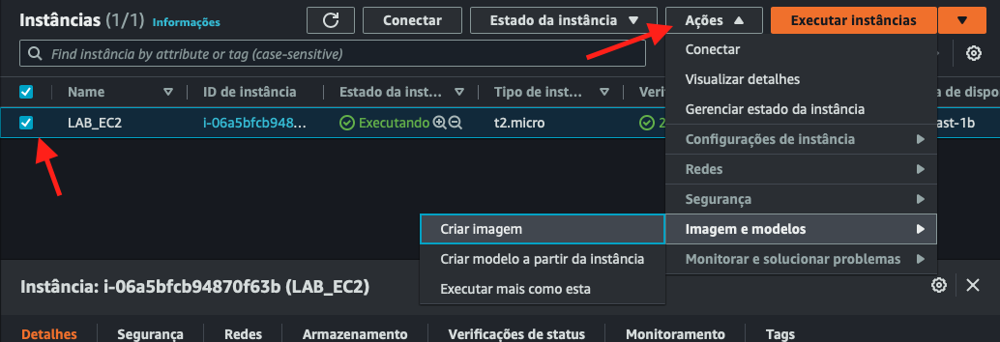
   
   
Vamos colocar um Nome e uma descrição na nossa AMI (`AMI_EC2_LAB`
)
O restante das configurações pode deixar de forma padrão (não precisa modificar)

   
   

Acesse o menu de AMI no serviço de EC2 e guarde o valor do ID da AMI gerada
`ami-08669891ee3aa5427`

> **Importante:** Observe tambem a coluna *Status* da AMI, a mesma deve estar como `Disponível`, caso esteja sendo provisionada, aguarde até a conclusão (este processo pode levar alguns minutos).

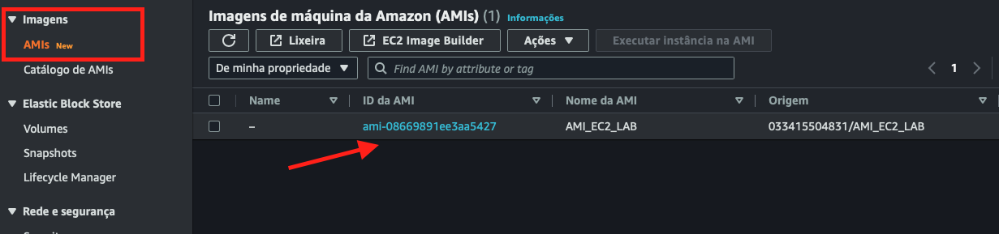

## Passo 7: Terminar a EC2 criada

Após a conclusão da criação da AMI e a mesma estiver como `Disponivel`, vamos iniciar o processo de encerramento da EC2.

Clique com o botão direto no mouse em cima do nome da *instância* e seleciona a opção *Encerrar Intância*

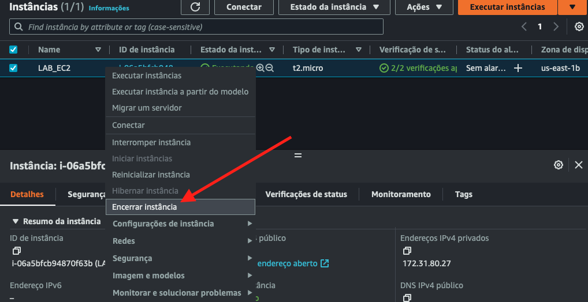

Ao abrir o popup de alerta, clique em *Encerrar*

> **Importante:** Após encerrar a *Instância* o acesso a aplicação nao estará mais funcional

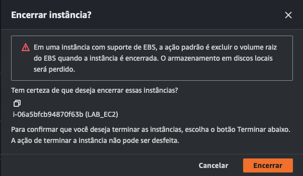

## Passo 7: Criar um Launch template

No Painel da EC2, vamos entrar em *Modelos de Execução*

Clicar em *Criar modelo de execução*

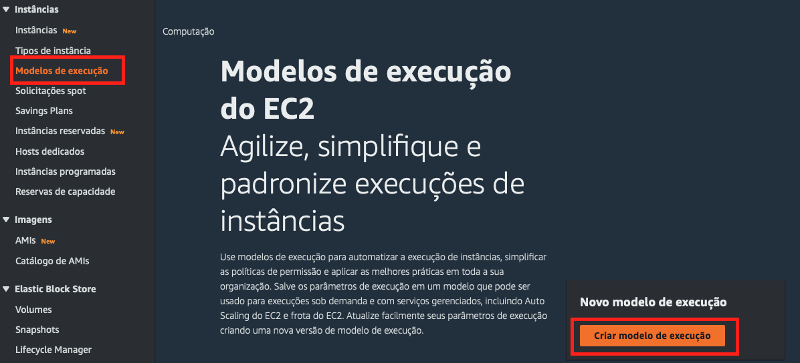

Colocar um *Nome* e uma *Descrição* para nosso template `TEMPLATE_LAB_EC2`

- Nome: `TEMPLATE_LAB_EC2`

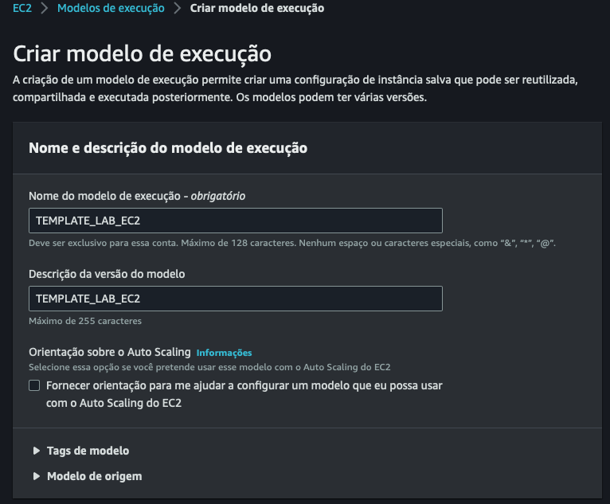

Selecionar a *AMI* que criamos

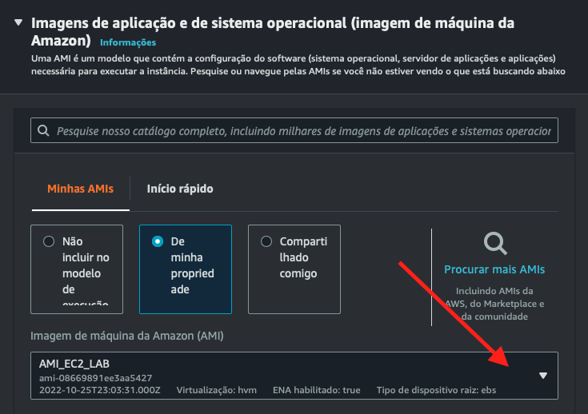

Colocar o *Tipo de instância* como `t2.micro` 

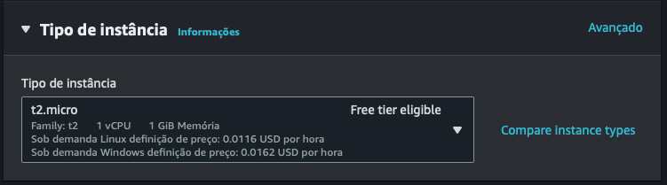

Selecionar o *par de chaves* que criamos para a nossa *Instância*

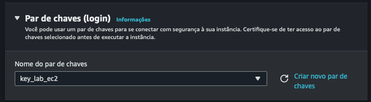

Vamos selecionar uma *subnet* (Na mesa Zona de Disponibilidade do nosso *Elastic Load Balancer*) e apontar o *Security Group* que criamos

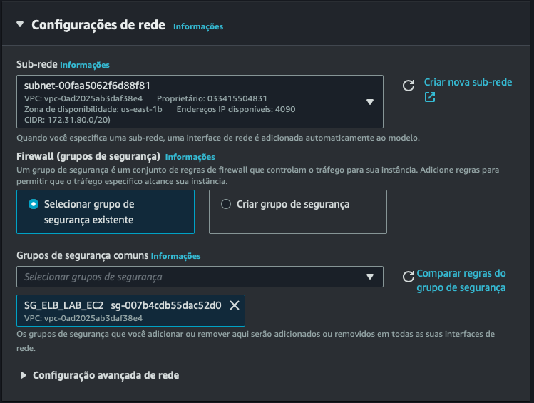

Podemos ver agora nosso *modelo de execução* criado.

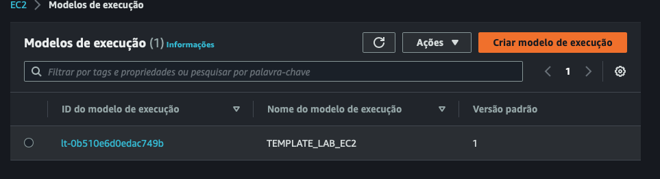

## Passo 8: Criar o Auto Scaling

No painel da EC2, vamos navegar no item *Auto Scaling* e *Grupos de Auto Scaling*

Clicar em *Criar grupo do Auto Scaling*

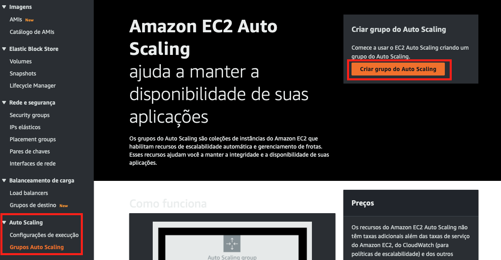

Colocar um *Nome* (`AS_LAB_EC2`) no nosso *Grupo do Auto Scaling*

Escolher o *Modelo de execução* (`TEMPLATE_LAB_EC2`) que criamos anteriormente

Clicar em *Próximo*.

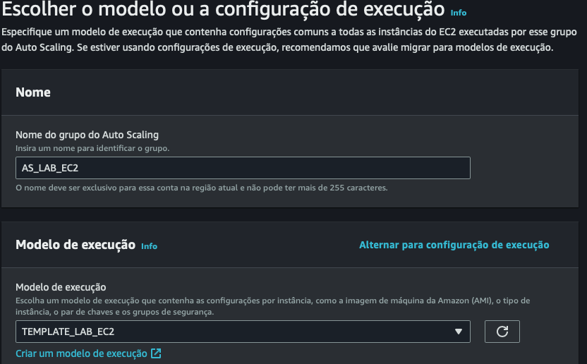

Selecionar a *VPC* e a *Zona de Disponibilidade* que criou o template(`us-east-1b`).

Clicar em *Próximo*.

Vamos anexar agora nosso *Load Balancer* e escolher o *Grupo de Destino* que criamos pra ele.

Clicar em *Próximo*.

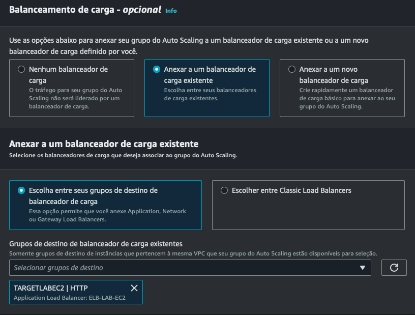

Configurar a capacidade do nosso *Grupo de Auto Scaling*
Colocar o valor `2` nas 3 opçoes de capacidade

Clicar em *Próximo*.

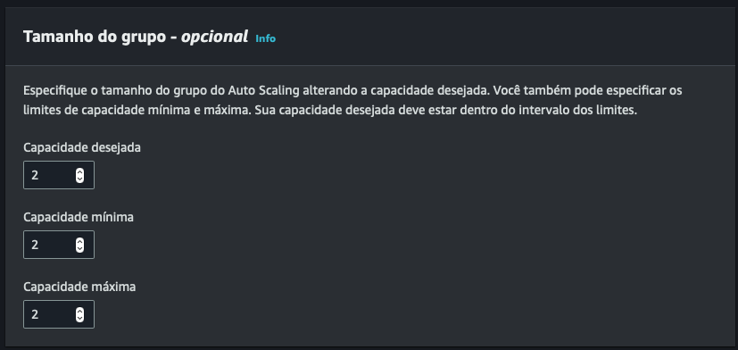

Na etapa de *Adicionar noficações*: Clicar em *Próximo*.

Na etapa de *Adicionar etiquetas*: Clicar em *Próximo*.

Clicar em *Criar grupo de Auto Scaling*

## Passo 9: Verificar funcionamento do Auto Scaling

Podemos ver que o *Auto Scaling* subiu duas *instâncias EC2* e a *Verificação de status* foi concluida.

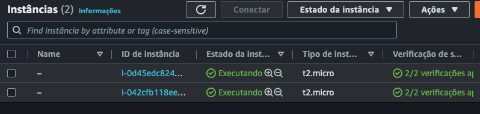

Podemos acessar o link do *Elastic Load Balancer* que criamos e validar o acesso

Vamos agora deletar uma *instância* e validar se o *Auto Scaling* vai subir uma nova *EC2*.

Selecionar a *instância*, clique com o botão direito do mouse e clique em *Encerrar instância*.

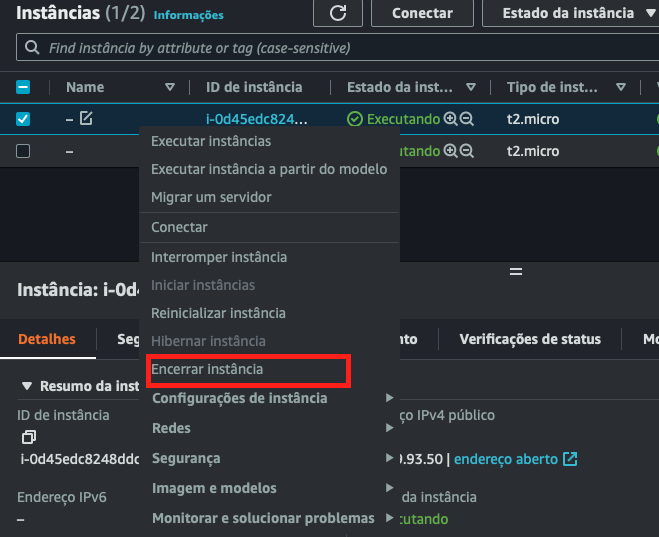

Podemos ver após terminar uma *instância* o Auto Scaling iniciou o provisionamento de outra.

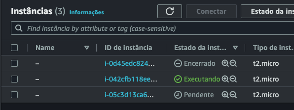

Assim que a *instância* estiver em execução, ja teremos as duas funcionando normalmente com nosso *Load Balancer*.

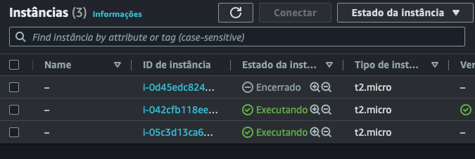

Finalizando o LAB temos uma aplicação escalavél na AWS utilizando o serviço de EC2 + ELB + Auto Scaling

That's all folks!