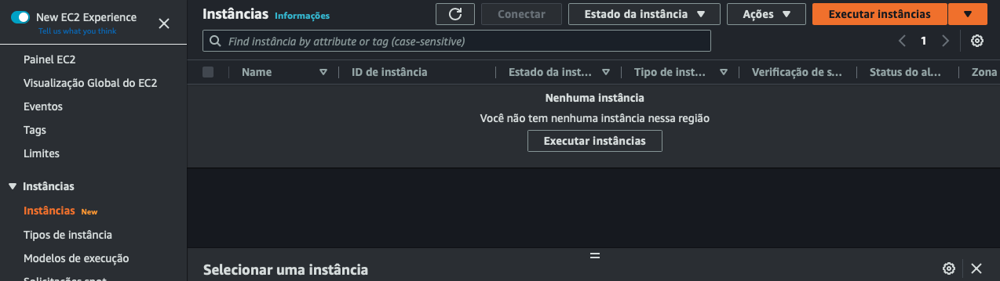
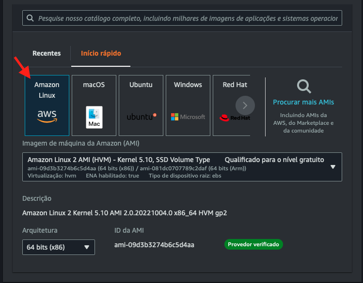
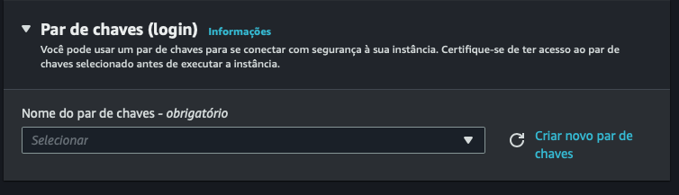
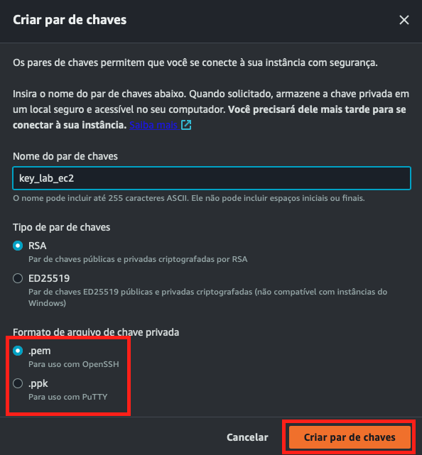
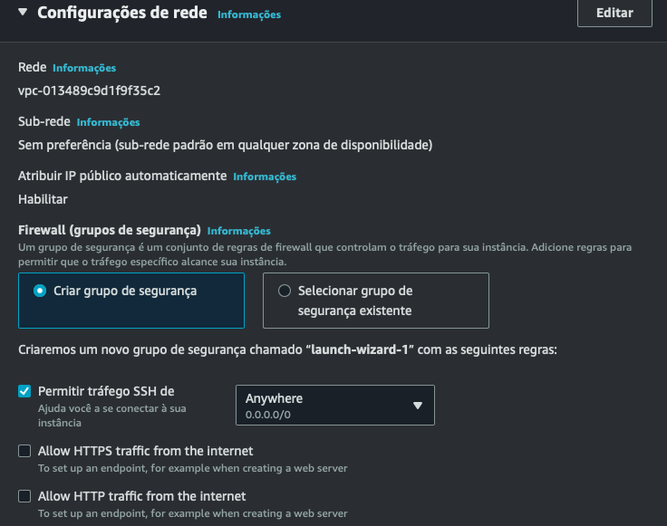
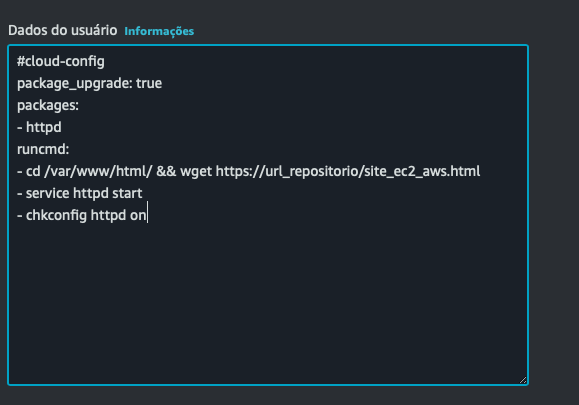

# CloudFaster Academy: Laboratório de resliência com EC2 + Load Balance + Auto Scaling

> **Autor:** [CloudFaster Tecnologia](https://cloudfaster.com.br), **Última revisão:** 25/10/2022

## Pré-requisitos

1) Uma conta na AWS.
2) Um usuário com permissões suficientes para acessar os recursos necessários (EC2, VPC, ELB, Auto Scaling).

## Passo 1: Subir uma EC2 com script de inicialização para aplicação web

Após acessar sua conta AWS, navegue até o serviço "EC2" ou acesse diretamente por esse link:
https://console.aws.amazon.com/ec2.

Clique em execultar instâncias

Agora vamos configurar os parâmetros da EC2.

- Nome: LAB_EC2

- Sistema Operacional: Vamos escolher o Amazon Linux com arquiterua 64bits

- Tipo de instância: Vamos selecionar a t2.micro a fim de utilizar o free tier da AWS

- Clicar em Criar nova chave de acesso

- Par de chaves de acesso:
    - Nome: key_lab_ec2
    - Tipo de par de chaves: Vamos deixar o padrão RSA
    - Formato:
        - .pem (recomendada para quem utiliza sistema operacional Linux ou Mac)
        - .ppk (recomendada para que utiliza sistema operacional Windows com o Putty instalado)

- Configurações de rede:
    - Criar grupo de segurança:
        - Permitir trafego SSH de:
            - Anywhere (é feita uma liberacao de acesso para qualquer destino)
            - Custom (é possível colocar um endereço de IP de onde deve ser feito o acesso)
            - MyIp (á AWS identifica seu IP de origem e faz a liberação apenas para ele)

- Configurações avançadas vamos colocar nosso script para que a EC2 execute o mesmo durante sua inicialização.
- Após essa etapa, clique em "Execultar instância", para que a mesma seja provisionada e inicializada

