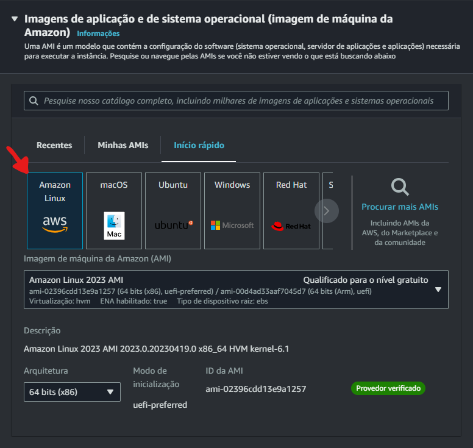

# CloudFaster Academy: Laboratório de resliência com EC2 + Load Balance + Auto Scaling

> **Autor:** [CloudFaster Tecnologia](https://cloudfaster.com.br), **Última revisão:** 25/10/2022

## Pré-requisitos

1) Uma conta na AWS.
2) Um usuário com permissões suficientes para acessar os recursos necessários (EC2, VPC, ELB, Auto Scaling).

## Passo 1: Subir uma EC2 com script de inicialização para aplicação web

Após acessar sua conta AWS, navegue até o serviço "EC2" ou acesse diretamente por esse link:
https://console.aws.amazon.com/ec2.

Clique em execultar instâncias

Agora vamos configurar os parâmetros da EC2.

- Nome: LAB_EC2

- Sistema Operacional: Vamos escolher o Amazon Linux com arquiterua 64bits

- Tipo de instância: Vamos selecionar a t2.micro a fim de utilizar o free tier da AWS

- Clicar em Criar nova chave de acesso

- Par de chaves de acesso:
    - Nome: key_lab_ec2
    - Tipo de par de chaves: Vamos deixar o padrão RSA
    - Formato:
        - .pem (recomendada para quem utiliza sistema operacional Linux ou Mac)
        - .ppk (recomendada para que utiliza sistema operacional Windows com o Putty instalado)

- Configurações de rede:
    - Criar grupo de segurança:
        - Permitir trafego SSH de:
            - Anywhere (é feita uma liberacao de acesso para qualquer destino)
            - Custom (é possível colocar um endereço de IP de onde deve ser feito o acesso)
            - MyIp (á AWS identifica seu IP de origem e faz a liberação apenas para ele)

- Configurações avançadas vamos colocar nosso script para que a EC2 execute o mesmo durante sua inicialização.
- Após essa etapa, clique em *"Execultar instância"*, para que a mesma seja provisionada e inicializada

## Passo 2: Testar o acesso web na aplicação

No painel do serviço de EC2, vamos verificar o estato da nossa instanância:

- Executando (EC2 ativa, provisionada e pronta para utilização)
- Prosionando (EC2 ainda está sendo disponiblizada pela AWS)

Vamos copiar o IP público da nossa instânia e testar em um navegado para validar a aplicação.    

> **Importante:** O IP externo utilizado no LAB é diferente do que vai aparecer na sua Console da AWS.

   

Observamos que foi retornado um erro de timeout de endereço de IP, isso ocorreu pois para validar a aplicação vamos precisar liberar a porta HTTP (TCP 80) no nosso Security Group.

Clicando na aba *"Segurança"* vamos clicar no nosso Security Group para editar as regas de acesso.

Selecionar a aba *"Regras de entrada"* e *"Editar regras de entrada"*.

Vamos *"Adicionar regras"*, selecionar o protocolo HTTP, Colocar para *"Qualquer origem"* e vamos *"Salvar regras"*.

Realizando um novo teste de acesso ao IP externo, vamos ter sucesso em acessar nossa aplicação.

## Passo 3: Criar um ELB (Elastic Load Balance)

Ainda dentro do serviço de [EC2](https://console.aws.amazon.com/ec2), vamos realizar a configuração do Elastic Load Balance.

Vamos clicar em *"Balanceamento de cargas - Load Balancers*

Clique em *"Criar Load Balancer"*

Temos três opções de Elastic Load Balancer:
- Application Load Balancer (Balanceador que atua na camada de aplicação nos protocolos HTTP e HTTPS)

- Network Load Balancer (Balanceador que atua na camada de rede fazendo chamadas nos protocolos TCP, UDP e TSL)

- Gateway Load Balancer (Distribuir tráfego entre dispositivos virtuais)

Como queremos balancer uma aplicação web, vamos utilizar o *"Applicaton Load Balance"*.

Preencher o nome (*ELB-LAB-EC2*) do nosso ELB, deixar ele com interface para internet e utilizar o padrão de IPV4.

No Painel de EC2, temos a coluna onde temos a *Zona de Disponibilidade* que ela está. no nosso exemploe ela fica em *`us-east-1`*

Na configuração do Load Balance, vemos que ele mostra todas as *Zonas de Disponilidade* que pertecem a VPC

Vamos selecionar *Duas*, uma é a que a nossa EC2 está (`us-east-1`) e podemos escolher outra onde futuramente podemos configurar outra EC2.

Configurar um novo *Security Group* para o nosso Load Balance

Atribuições:
- *Nome* para o *Security Group* 
- Adicionar o protocolo HTTP para ser acessado que qualquer origem

Vamos selecionar o *Security Group* criado para o nosso ELB

## Passo 4: Registrar a EC2 no ELB (Elistic Load Balance)

Clique em  *Create Target Group*

Na configuração do *Target Group*, temos alguns tipos de *Target*, pro nosso ALB vamos utilizar o Type `Instância`

Vamos colocar um *Nome* e a porta que o nosso *Target* vai trabalhar.
- Porta 80 (protocolo HTTP)

Seleciona a *Instância* que foi criada no inicio do LAB e clique em *Include as pending below*.

Criando nosso Listener
Vamos selecionar o *Target Group* que acabamos de criar

Clicar quem *Criar Load Balancer*

## Passo 5: Testar o acesso pelo ELB (Elastic Load Balance)

Navegando na tela da Load Balance vamos copiar o nome de DNS criado para testar o acesso em um navegado

> **Importante:** Para o ELB ficar como *Ativo* pode demorar alguns minutos.

Cole o link do DNS do Load Balancer e acesse sua aplicação

## Passo 6: Criar uma AMI e guardar o ID

## Passo 7: Terminar a EC2 criada

